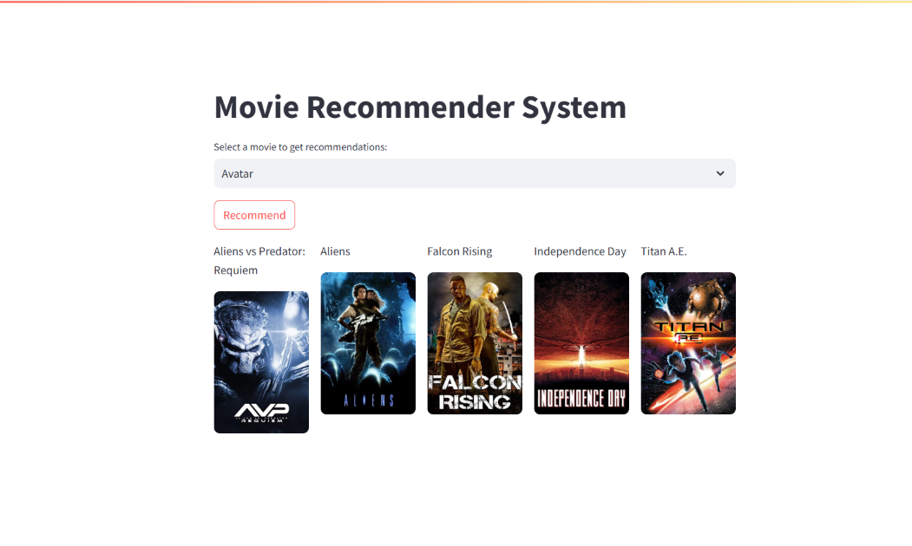

# MOVIE RECOMMENDATION SYSTEM



## About
Welcome to the Movie Recommendation System! This project is my first Python application, developed as a group effort during my third academic semester. It's a simple yet effective movie recommendation system that leverages a content-based filtering approach to suggest movies to users. The system recommends films based on various attributes, dynamically asking the user for their preferences to tailor suggestions.

First we will need to collect data about the movies for this use **tmdb 5000 movie dataset from kaggle** [Visit Dataset](https://www.kaggle.com/datasets/tmdb/tmdb-movie-metadata "Download or get more information about the dataset"). The flow of project is mainly divided into four parts: **data collection, data preprocessing, model building and creating website**.

The project workflow is primarily divided into four key stages: data collection, data preprocessing, model building, and web application creation.
## Installations
1. Clone the repo:
   ```sh
   git clone https://github.com/jainamb12/movie-recommendation-system.git
   ```
2. Install the required packages:
   ```sh
   pip install numpy pandas streamlit scikit-learn nltk
   ```
3. Run the project using command:
   ```sh
   streamlit run app.py
   ``` 
   **NOTE** : In case the above command doesn't work, try running the file by giving absolute file path in your terminal:

## Logic
\* Merge two datasets: tmdb_5000 and tmdb_5000_credits on basis of title. This will give us the complete information about the movies.

\* Preprocess the data by removing unnecessary columns and reassigning to old df. We have to add or club the columns **genres, keywords, cast, crew** to **overview** make them more meaningful. for this we need to improve formate of the columns. **convert and similar name method** is implemented to fullfill this task. Doing this we will have single column called **tags** which has all the information about the movie in list formate and we convert it into string to processs further.

\* Out aim is to recommend top 5 movies on basis of **similarity of tags**. That means **similarity score** between any two movies depends on **how much similar their tags are**.

\* For this we will use **CountVectorizer** module which convert text into numerical form through **Bag of Words** logic.

\* Logic bag of words is, **first merging all 5000 tags to create large text from which we are extracting 5000 most common words. Then calculating number of occurrences of each word in each tag.** It is importanrt to use **steamer** to **normalize** the text.

\* This results in **(5000,5000)** array in which we calculate **cosine distance** between each vector and recommend 5 least one as that will be nearest to the user input.

## Features
1. Content Based Recommendation System
2. User Input for preferences
3. Attractive UI using Streamlit
4. Use of **API** to fetch movie poster from tmdb website
5. Handles exceptions and errors properly in case server is busy
6. Deployed on **streamlit cloud** for easy access

## Contributing
Contributions are welcome! Follow these steps:
1. Fork the project.
2. Create a new branch (`git checkout -b feature-branch`).
3. Commit your changes (`git commit -m 'Add feature'`).
4. Push to the branch (`git push origin feature-branch`).
5. Open a pull request.
